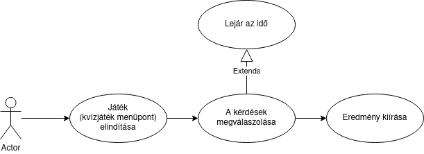

# MMMZ
## 1. A Rendszer célja
A rendszer célja egy interaktív kvízjáték, amellyel az ügyfél cégét ismerhetik meg a kiállításra érkező érdeklődők és látogatók. 
A kvízjátékhoz tartozó kérdéseket és a válaszokat egy config fájlban tároljuk.

## 2. Üzleti folyamatok modellje

## 3. Követelmények
* Funkcionális
    -A kvízjátékhoz szükséges kérdések és válaszok lekérdezése és betöltése a config fájlból.
    -Reaktív komponensek létrehozása, melyekkel a felhasználó interakcióba tud lépni.

## 4. Funkcionális terv
* Rendszerszereplő:
    -Felhasználó

### Rendszerhasználati esetek:
* Felhasználó a kvízjátékban:
    -Interakcióba tud lépni a reaktív komponensekkel, részt tud venni egy kvízjátékban ahol tesztelheti a tudását.
    -Látja a kvízjáték végén az elért eredényét.
    -Helytelen válasz esetén a valódi helyes válasz megjelenítése a felhasználónak.
    -A kérdés megválaszolására megadott idő lejárta után, a helyes válasz megjelenítése.
    
## 5. Fizikai környezet
* Felhasznált és alkalmazott technológiák:
    -React
    -TypeScript
    -TailwindCSS

* Fejlesztői környezet:
    -Visual Studio Code
    -IntelliJ Community Edition, JetBrains WebStorm

## 6. Architekturális terv
A kvízjáték alkalmazás egy szervergépen fog futni, melyre a felasználó böngészővel csatlakozik.
* Specifikáció:
    - Szükséges egy megfelelő minőségű és sebességű internetkapcsolat, illetve egy böngésző (microsoft Edge, firefox, chrome, stb..)

## 7. Adatbázis terv
A kérdéseket és a válaszokat tartalmazó adatbázisként szolgáló config fájl tartalma:
* Kérdések (Questions)
    -id
    -question
    -answerID
    -correctAnswerID

* Válaszok (Answers)
    -id
    -answer

## 8. Implementációs terv
A kvízjáték alkalmazás egy szervergépen fog futni, melyre a felasználó böngészővel csatlakozik.

## 9. Tesztterv
A minimum hardverkonfiguráció: Intel Celeron processzor, 4GB RAM, 128GB HDD, a képernyők felbontása 
1280x1024 vagy 1920x1080 legalább 10Mbit/s letöltési sebességgel rendelkező internetkapcsolat.

A tesztelés során a szoftver megfelelő működését vizsgáljuk. Amennyiben az elvártnak megfelelő 
eredményt kapunk, a teszt eset sikeresnek tekinthető, ellenkező esetben a hibát rögzítjük a teszt jegyzőkönyvben. Ezt követően a megtalált
hibákat javítjuk a szoftverben, és újbóli tesztelésnek vetjük alá a rendszert.

## 10. Telepítési terv
* Fizikai telepítési terv: 
    - Szükség van a megfelelő specifikációs számítógépre.  
* Szoftver telepítési terv: 
    - Szükség van megfelelő internetkapcsolatra.

## 11. Karbantartási terv
A kvízjáték alkalmazásnak nincs szüksége különösebb karbantartásra.
